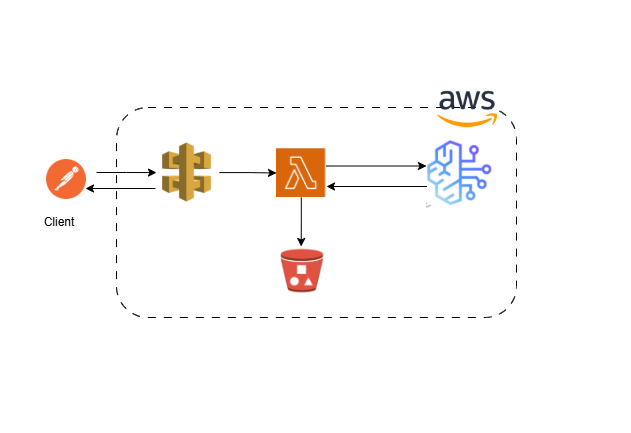

# AWS Bedrock Blog Generator

A serverless GenAI app that generates a blog post from a user-given title/topic, using AWS Bedrock.

## Architecture
**Client ↔ API Gateway ↔ Lambda ↔ Bedrock**, with Lambda writing output to **S3**.

Client sends a blog topic via API Gateway → Lambda invokes a Bedrock model to generate the content → result is saved to S3 → response sent back to client.

## AWS Services Used
- **Bedrock** – `meta.llama3-70b-instruct-v1:0` model for blog generation
- **Lambda** – core compute, runs `lambda_function.py`
- **API Gateway** – HTTP endpoint to trigger the function
- **S3** – stores generated blog posts (`blog-output/<timestamp>.txt`)
- **CloudWatch** – logs

## Files in this repo
| File | Description |
|---|---|
| `lambda_function.py` | Lambda function code that calls Bedrock and generates the blog |
| `aws-blog-generation` (demo video) | End-to-end demo of the app in action |
| Setup guide (docx) | Step-by-step screenshots of building this on AWS console |

## How it works
1. Send a `POST` request to the API Gateway endpoint with a JSON body: `{"blog_topic": "..."}`.
2. Lambda formats the prompt and invokes the Bedrock model.
3. Generated blog text is saved to S3 as `blog-output/<timestamp>.txt`.
4. Response returns the topic, S3 bucket, and a success message.

